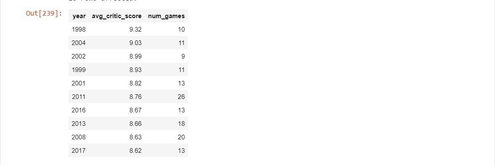
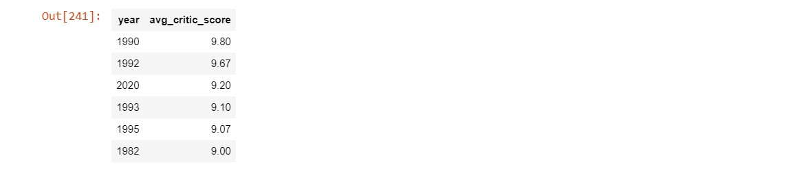

# When_Was_the_Golden_Age_of_Video_Games

# Introduction
Video games are big business: the global gaming market is projected to be worth more than $300 billion by 2027 according to Mordor Intelligence. With so much money at stake, the major game publishers are hugely incentivized to create the next big hit. But are games getting better, or has the golden age of video games already passed?
In this project, I'll be exploring the top 400 best-selling video games created between 1977 and 2020. Then compare a dataset on game sales with critic and user reviews to determine whether or not video games have improved as the gaming market has grown.

# Top ten selling video games of all time
We'll be delving into this project by exploring the top ten videos of all time. The query result shows the best-selling video games between 1985 and 2017. with "Wii Sports for Wii" topping the list of the best-selling video games of all time in the year 2006 and "New Super Mario Bros. Wii for Wii" in the year 2009.

# Missing review scores
The query result shows that 31 games were not reviewed which is less than ten percent of the games. This is a small percentage of our dataset. Exploration of the data can continue but it's important to keep this figure in mind. 

# Years that video game critics love

# Was 1982 really that great?

# Years that dropped off the critics' favorite list

# Years video game players loved

# Years that both players and critics loved
# Sales in the best video game years
